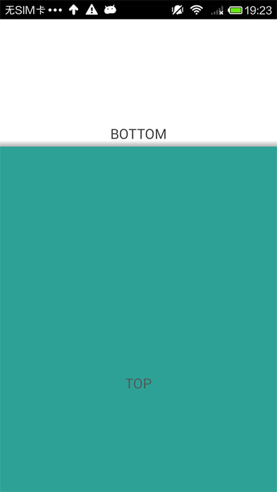
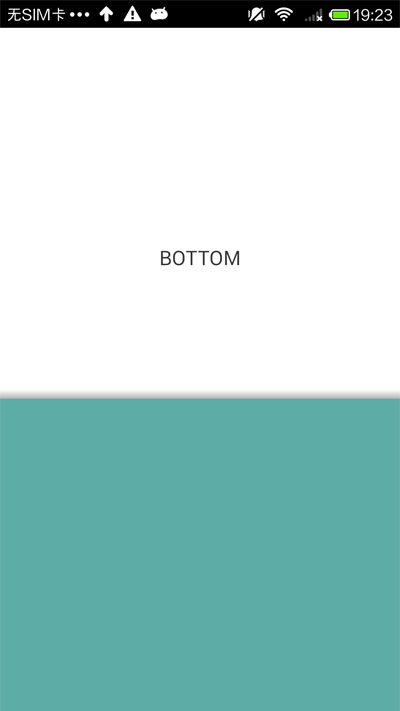
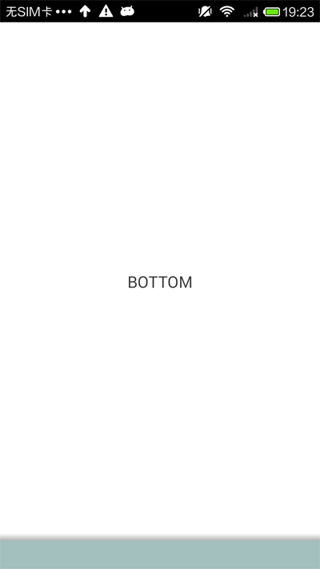

SlidingUpPaneLayout
===================

SlidingUpPaneLayout provides a vertical, multi-pane layout for use at the top level of a UI.You can slide up and down to slide the top view,  exactly like android.support.v4.widget.SlidingPaneLayout, but the direction is vertical.

##ScreenShot
&nbsp;
&nbsp;

