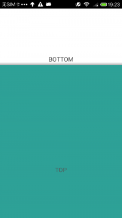
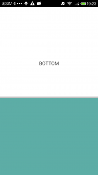
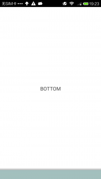

SlidingUpPaneLayout
===================

SlidingUpPaneLayout provides a vertical, multi-pane layout for use at the top level of a UI.You can slide up and down to slide the top view,  exactly like android.support.v4.widget.SlidingPaneLayout, but the direction is vertical.

top view is slidable, and bottom view is fixed.

##ScreenShot
&nbsp;
&nbsp;

##How To Use

just exactly like SlidingPaneLayout, you can write in XML like this:
<?xml version="1.0" encoding="utf-8"?>
<com.chenjishi.slideupdemo.SlidingUpPaneLayout
        xmlns:android="http://schemas.android.com/apk/res/android"
        android:id="@+id/sliding_up_layout"
        android:layout_width="match_parent"
        android:layout_height="match_parent">
    <LinearLayout
            android:id="@+id/bottom_view"
            android:layout_width="match_parent"
            android:layout_height="match_parent"
            android:gravity="center"
            android:background="#FFF"
            android:orientation="vertical">
        <TextView
                android:layout_width="wrap_content"
                android:layout_height="wrap_content"
                android:text="BOTTOM"
                android:textSize="18sp"
                android:textColor="#333"/>
    </LinearLayout>
    <LinearLayout
            android:id="@+id/top_view"
            android:layout_width="match_parent"
            android:layout_height="match_parent"
            android:gravity="center"
            android:background="#009588"
            android:orientation="vertical">
        <TextView
                android:layout_width="wrap_content"
                android:layout_height="wrap_content"
                android:text="TOP"
                android:textSize="18sp"
                android:textColor="#333"/>
    </LinearLayout>
</com.chenjishi.slideupdemo.SlidingUpPaneLayout>

